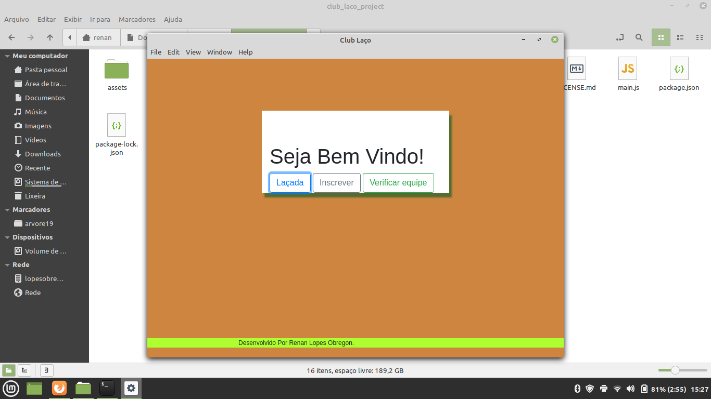
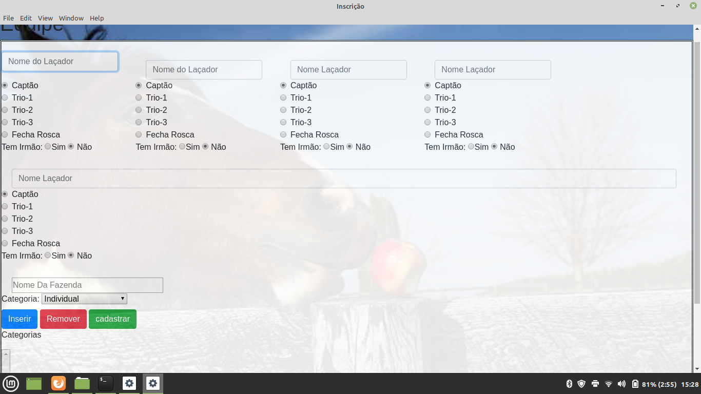
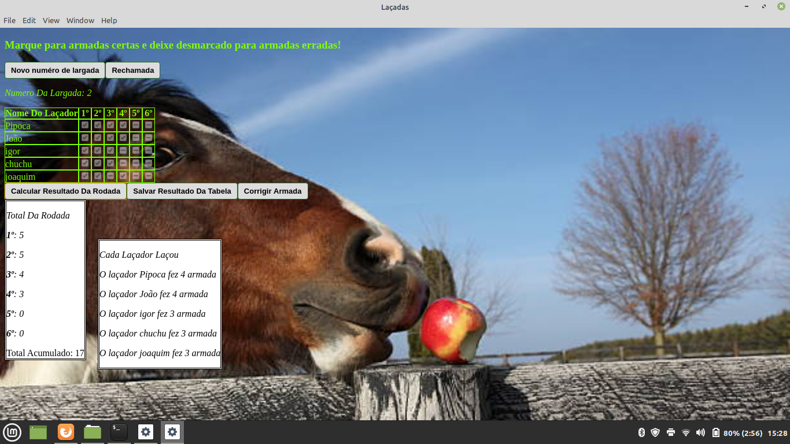

# Gerenciador de esporte club do laço

Projeto feito para gerenciar um esporte de laço cumprido no estado de mato grosso do sul

O projeto conta com sistema de inscrição, busca e marcador de pontos. Todo o sistema funciona offline, conta também com um banco de dado para armazenar os inscritos e os pontos de cada 'laçador' ou participante

<ul>
    <li>
        #Tela Principal
         
        
    </li>
    <li>
        #Tela De Inscrição
         
        
    </li>
     <li>
        #Tela De Marcação De Pontos
         
        
    </li>
</ul>
